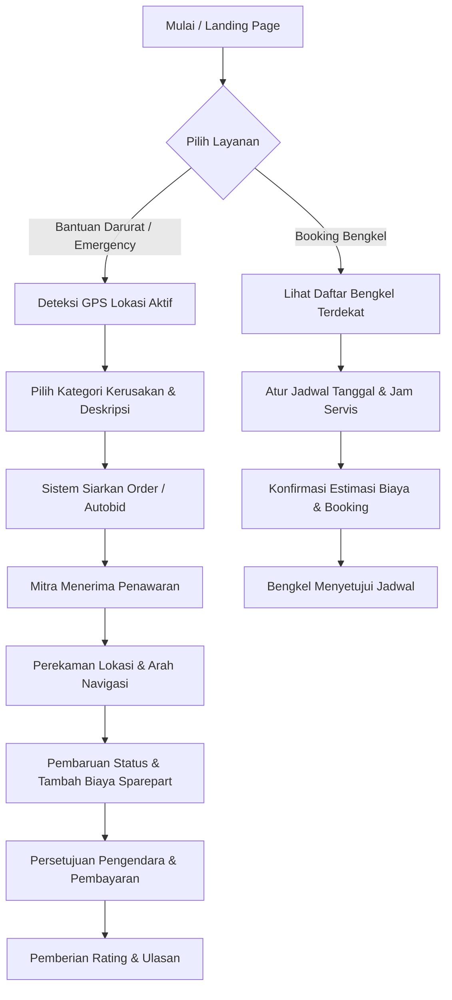

# OTOVA - Partner Onboarding & Emergency Roadside Assistance System

OTOVA adalah platform bantuan darurat kendaraan terpadu yang menghubungkan pemilik kendaraan dengan bengkel statis, montir freelance (keliling), dan penyedia tambal ban terdekat menggunakan koordinat GPS secara real-time. Platform ini dilengkapi alur verifikasi dokumen pendaftaran mitra oleh administrator, sistem pemesanan langsung (autobid), dan dompet digital (wallet) penarikan saldo pendapatan untuk mitra.

---

## 🛠️ Stack Teknologi

Berikut adalah daftar lengkap spesifikasi teknologi, versi, dan fungsi masing-masing komponen yang digunakan di dalam platform OTOVA:

| No | Kategori | Teknologi | Versi | Fungsi |
| :---: | :--- | :--- | :--- | :--- |
| **1** | Frontend Framework | **Next.js (React)** | `^14.2.10` (React `^18.3.1`) | Membangun user interface web responsif yang modern, server-side rendering, client-side routing, dan interaksi dinamis. |
| **2** | Backend Framework | **Next.js Router Handlers** | `^14.2.10` (App Router) | Menangani validasi dan pemrosesan data, autentikasi sesi, upload berkas gambar, serta webhook verifikasi admin. |
| **3** | Bahasa Pemrograman | **TypeScript** | `^5.5.4` | Memberikan pengetikan statis berorientasi objek yang kuat (*strongly-typed*) pada frontend dan backend guna mencegah error saat runtime. |
| **4** | Styling Framework | **Tailwind CSS** | `^3.4.10` | Menyediakan utility-first classes untuk merancang animasi, layout responsif (mobile/desktop), dan aksen desain glassmorphism premium. |
| **5** | Database | **Supabase PostgreSQL** | `16.x` | Menyimpan data User, Mitra, Order Bantuan Darurat, Rating, Dompet/Saldo, dan Notifikasi secara aman dan persisten. |
| **6** | ORM | **Prisma ORM** | `^5.19.1` | Melakukan sinkronisasi skema database, memfasilitasi seeding otomatis, serta menyediakan interface query type-safe berbasis TypeScript. |
| **7** | Authentication | **Stateless Cookie Session & JWT** | `jose ^5.9.2` & `bcryptjs ^2.4.3` | Menangani hashing kata sandi pengguna secara aman di backend, enkripsi token sesi JWT, serta proteksi hak akses tingkat admin/mitra. |
| **8** | Maps / Location API | **Geolocation Web API & OpenStreetMap Nominatim** | Standard Web API | Mendeteksi titik koordinat latitude/longitude GPS aktual perangkat pengguna secara akurat dan menerjemahkannya ke nama lokasi alamat jalan. |
| **9** | Payment Gateway | **Manual / OTOVA Wallet** | Integrasi Skema Database | Pencatatan total pendapatan transaksi perbaikan, manajemen saldo dompet digital mitra, dan pelaporan riwayat penarikan (withdraw). |
| **10** | Hosting / Deployment | **Vercel Cloud Platform** | Serverless Edge | Hosting serverless web app, deployment otomatis berbasis integrasi git branch utama, serta menyediakan SSL/HTTPS instan secara gratis. |
| **11** | Version Control | **Git & GitHub** | Github Remote Repository | Kolaborasi kode sumber (*source code*), pelacakan riwayat perubahan kode proyek, dan integrasi Continuous Deployment. |
| **12** | UI/UX Design | **Lucide Icons** | `^0.439.0` | Menyediakan visual aset ikon modern minimalis di dashboard admin, mitra, mau pun pelanggan. |
| **13** | Code Editor | **VS Code / Cursor** | Versi Terbaru | Lingkungan kerja utama pengembangan kode sumber (Integrated Development Environment). |
| **14** | Package Manager | **npm** | `10.x` (Bawaan Node) | Menginstalisasi dependency proyek secara cepat, mengelola eksekusi runner script, dan mengelola paket pihak ketiga. |
| **15** | Runtime Environment | **Node.js** | `^20.16.5` / `20.x` | Runtime engine di sisi server dan lokal lokal untuk menjalankan backend Next.js. |

---

## 🚀 Fitur Utama

- **Pendaftaran Mitra Terpadu (Onboarding)**:
  - Pendaftaran langsung (anonim) yang menggabungkan pembuatan akun utama dan pengisian berkas kemitraan dalam satu formulir tunggal.
  - Upload dokumen asli (KTP & Foto Tempat Usaha) secara langsung ke penyimpanan aset lokal melalui REST API `/api/upload`.
- **Verifikasi Admin Otomatis**:
  - Halaman panel Verifikasi Admin (`/admin/verifikasi-mitra`) untuk meninjau, menyetujui, atau menolak permohonan kemitraan.
  - Sesi persetujuan secara otomatis meningkatkan hak akses role pengguna dari `'user'` menjadi `'mitra'` secara instan agar bisa mengakses panel mitra.
- **Deteksi GPS Real-Time**:
  - Pelacakan dan penentuan lokasi bengkel atau montir keliling terdekat menggunakan formula perhitungan jarak geografis (Haversine formula).
  - Integrasi reverse geocoding via OpenStreetMap untuk akurasi alamat.
- **Dompet Digital & Saldo Tarik Mandiri**:
  - Dashboard Mitra (`/mitra/dashboard`) menampilkan pendapatan kumulatif dan saldo dompet OTOVA yang siap ditarik secara real-time.

---

## 🗺️ Alur Aplikasi (Workflows)

### 1. Alur Pelanggan (Customer Flow)


*   **Pencarian Bantuan Darurat (Emergency Roadside)**:
    1.  Pengendara menekan tombol **Cari Bantuan Darurat**.
    2.  Browser mendeteksi koordinat latitude dan longitude terkini menggunakan Geolocation API secara aman (HTTPS).
    3.  Pengendara memasukkan jenis kendaraan dan keluhan kerusakan (ban bocor, mogok, dll.).
    4.  Sistem menyebarkan order ke mitra/montir keliling terdekat menggunakan formula jarak Haversine.
    5.  Setelah mitra menyetujui, pengendara dipindahkan ke laman live tracking dalam waktu 3 detik.
    6.  Semua pembaruan biaya (misal pembelian oli/ban) selama perbaikan berlangsung memerlukan konfirmasi ketuk klik persetujuan dari sisi pengendara.
*   **Pemesanan Servis Berkala (Booking Bengkel)**:
    1.  Pengendara menekan tombol **Booking Bengkel** dan melihat katalog bengkel statis terdekat.
    2.  Pengendara menjadwalkan hari dan jam tanpa perlu antre di tempat.

---

### 2. Alur Mitra & Teknisi (Partner Flow)
```mermaid
graph TD
    A[Pengunjung Web] --> B[Klik 'Daftar Sebagai Mitra']
    B --> C{Sudah Login?}
    C -- Belum --D[Lengkapi Akun Baru & Berkas KTP/Usaha]
    C -- Sudah --> E[Lengkapi Berkas Kemitraan Saja]
    D & E --> F[Kirim Berkas - Status PENDING]
    F --> G[Admin Verifikasi Berkas di Panel Kerja]
    G -- Disetujui --> H[Role Upgraded Jadi 'Mitra']
    H --> I[Masuk Panel Dashboard Mitra]
    I --> J[Mengubah Status Jadi 'ONLINE']
    J --> K[Terima Permintaan Order / Autobid]
    K --> L[Proses Servis di Lokasi Pelanggan]
    L --> M[Order Selesai - Saldo Masuk ke Wallet]
    M --> N[Tarik Saldo Mandiri / Withdraw]
```

*   **Pendaftaran & Validasi Dokumen**:
    1.  Pengguna membuka formulir `/register-mitra` (bisa diisi langsung oleh user yang belum login).
    2.  Mengunggah foto KTP asli dan foto tempat usaha yang disimpan ke direktori `./public/uploads`.
    3.  Admin memeriksa permohonan melalui portal `/admin/verifikasi-mitra`.
    4.  Saat disetujui, status berubah menjadi `approved` dan role akun naik kelas secara otomatis menjadi `'mitra'`.
*   **Penerimaan Pekerjaan & Pendapatan**:
    1.  Mitra mengaktifkan toggle **ONLINE** dan mode **Autobid** (jika ingin menerima order instan tanpa klik terima).
    2.  Setiap order darurat terdekat yang masuk akan membunyikan notifikasi rute perbaikan.
    3.  Setelah perbaikan rampung, total biaya masuk ke **Wallet OTOVA** mitra.
    4.  Mitra dapat mengajukan tarik dana (**Withdraw**) secara instan ke rekening bank mereka kapan saja melalui tombol Dashboard.

